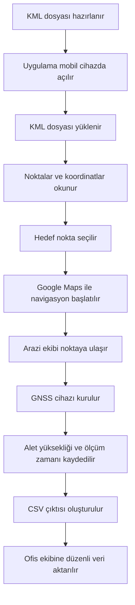

# KML Navigator

**KML Navigator**, arazi ekiplerinin KML dosyaları üzerinden tanımlanan ölçü noktalarına mobil cihazla hızlıca ulaşmasını, Google Maps ile navigasyon başlatmasını ve statik GNSS ölçüm bilgilerini düzenli şekilde CSV formatında kaydetmesini sağlayan web tabanlı bir saha yardımcı aracıdır.

Bu proje; harita mühendisliği, fotogrametrik harita üretimi, yer kontrol noktası tesisi, karayolu yersel alımı ve arazi-ofis veri aktarımı süreçlerinde karşılaşılan zaman kayıplarını azaltmak amacıyla geliştirilmiştir.

---

## Live Demo

Uygulama GitHub Pages üzerinden çalıştırılabilir:

```text
https://enesvta.github.io/KML-NAVIGATOR/
```

---

## Project Overview

Arazi ekipleri, nokta tesis edilecek koordinatlara genellikle KML dosyaları üzerinden ulaşır. Bu süreçte noktaların Google Earth üzerinde manuel kontrol edilmesi, koordinatların ayrı navigasyon uygulamalarına aktarılması, statik GNSS ölçüm bilgilerinin elle not alınması ve ofise düzenli formatta iletilmesi zaman kaybına neden olabilir.

**KML Navigator**, bu süreci tek bir mobil arayüzde birleştirir:

- KML dosyasındaki nokta ve tahdit verilerini okur.
- Nokta kimlik bilgilerini ve koordinatları kullanıcıya gösterir.
- Google Maps üzerinden hedef noktaya navigasyon başlatır.
- Statik GNSS ölçümleri için alet yüksekliği, başlangıç zamanı, bitiş zamanı ve cihaz bilgilerini kaydeder.
- Kayıtları CSV formatında dışa aktararak ofis ekibine düzenli veri aktarımı sağlar.

---

## Problem

Saha çalışmalarında sık karşılaşılan problemler:

- Noktaların Google Earth üzerinde manuel aranması
- KML dosyalarının mobil ortamda pratik kullanılamaması
- Araç içi navigasyon için koordinatların elle aktarılması
- Statik GNSS ölçümlerinde alet yüksekliği ve zaman bilgilerinin manuel not alınması
- Ofis ekibine ölçüm bilgilerinin dağınık veya eksik iletilmesi
- Arazi ekibi ile ofis ekibi arasındaki veri akışının yavaş ilerlemesi

---

## Solution

KML Navigator, arazi ekibinin sahada ihtiyaç duyduğu temel işlemleri sade bir mobil arayüzde toplar.

Uygulama sayesinde:

- KML içindeki noktalar doğrudan okunabilir.
- Nokta listesi üzerinden istenen hedef seçilebilir.
- Kullanıcı konumu ve hedef nokta harita üzerinde görüntülenebilir.
- Google Maps ile anında navigasyon başlatılabilir.
- GNSS statik ölçüm bilgileri sahada kaydedilebilir.
- Ölçüm kayıtları CSV dosyası olarak dışa aktarılabilir.

---

## Screenshots

README içinde görsellerin otomatik görünmesi için repository içinde aşağıdaki klasör yapısını oluşturun:

```text
docs/
└── screenshots/
    ├── 01-home.png
    ├── 02-kml-upload.png
    ├── 03-map-view.png
    ├── 04-point-detail.png
    ├── 05-gnss-record.png
    └── 06-csv-export.png
```

### Home Screen


### KML Upload


### Map View


### Point Detail and Navigation


### GNSS Record Form


### CSV Export


---

## Suggested Visuals

Projeyi daha profesyonel göstermek için aşağıdaki görseller eklenebilir:

| Görsel | Açıklama |
|---|---|
| `01-home.png` | Uygulamanın ana ekranı |
| `02-kml-upload.png` | KML dosyası yükleme ekranı |
| `03-map-view.png` | Noktaların Google Maps üzerinde gösterimi |
| `04-point-detail.png` | Nokta kimlik bilgisi ve navigasyon ekranı |
| `05-gnss-record.png` | Statik GNSS ölçüm kayıt formu |
| `06-csv-export.png` | CSV dışa aktarım çıktısı |

---

## Main Features

- KML dosyası yükleme
- KML içindeki nokta adlarını ve koordinatları okuma
- Tahdit / çalışma alanı bilgisini sahada kullanılabilir hale getirme
- Noktaları Google Maps üzerinde görüntüleme
- Kullanıcı GPS konumunu takip etme
- Nokta listesi üzerinden hedef seçimi
- Google Maps ile hedef noktaya navigasyon başlatma
- Araç içi navigasyon sistemleriyle kullanılabilir saha yönlendirme mantığı
- Statik GNSS ölçüm kayıt formu
- Alet yüksekliği kaydı
- Başlangıç ve bitiş zamanı kaydı
- Cihaz adı / ölçüm bilgisi kaydı
- CSV formatında dışa aktarım
- Mobil uyumlu arayüz
- GitHub Pages üzerinde çalışabilen hafif yapı
- PWA yapısı için manifest ve service worker desteği

---

## Field Workflow



---

## Use Cases

KML Navigator aşağıdaki çalışmalarda kullanılabilir:

- Yer kontrol noktası tesisi
- Nirengi ve poligon noktası takibi
- Fotogrametrik harita üretimi saha hazırlığı
- Karayolu yersel alım çalışmaları
- Statik GNSS ölçümleri
- Arazi-ofis veri aktarımı
- KML tabanlı saha navigasyonu
- Proje sınırı ve nokta koordinatı kontrolü
- Saha ekiplerinin noktalara kontrollü ulaşımı

---

## Technologies Used

| Technology | Purpose |
|---|---|
| HTML | Uygulama arayüz yapısı |
| CSS | Mobil uyumlu tasarım |
| JavaScript | KML okuma, harita kontrolü, kayıt ve CSV işlemleri |
| Google Maps JavaScript API | Harita görüntüleme ve navigasyon bağlantıları |
| Geolocation API | Kullanıcı konumu alma |
| LocalStorage | Geçici veri saklama |
| CSV Export | Ölçüm kayıtlarını dışa aktarma |
| GitHub Pages | Web yayınlama |
| Web Manifest | PWA yapılandırması |
| Service Worker | PWA / önbellekleme desteği |

---

## How It Works

1. Kullanıcı uygulamayı mobil cihazdan açar.
2. KML dosyasını seçer.
3. Uygulama KML içindeki nokta adlarını ve koordinatları okur.
4. Noktalar harita üzerinde görüntülenir.
5. Kullanıcı hedef noktayı seçer.
6. Google Maps üzerinden navigasyon başlatılır.
7. Arazi ekibi noktaya ulaştığında statik GNSS ölçüm bilgilerini girer.
8. Alet yüksekliği, başlangıç zamanı, bitiş zamanı ve cihaz bilgileri kaydedilir.
9. Ölçüm kayıtları CSV olarak dışa aktarılır.
10. CSV dosyası ofis ekibine aktarılır.

---

## CSV Output

Uygulama, saha ölçüm kayıtlarını CSV formatında dışa aktarır.

Örnek CSV alanları:

```text
Tarih, Nokta, Cihaz Adı, Alet Yüksekliği, Yük Tipi, Başlangıç Saati, Bitiş Saati, Koordinat
```

Örnek çıktı:

```csv
Tarih,Nokta,Cihaz Adı,Alet Yüksekliği,Yük Tipi,Başlangıç Saati,Bitiş Saati,Koordinat
2025-08-12,NK-101,GNSS-01,1.72m,Statik,09:15,10:45,"39.9207,32.8541"
2025-08-12,NK-102,GNSS-02,1.68m,Statik,11:10,12:40,"39.9182,32.8617"
```

---

## Project Structure

```text
KML-NAVIGATOR/
│
├── icons/
│   └── logo.jpg
│
├── docs/
│   └── screenshots/
│       ├── 01-home.png
│       ├── 02-kml-upload.png
│       ├── 03-map-view.png
│       ├── 04-point-detail.png
│       ├── 05-gnss-record.png
│       └── 06-csv-export.png
│
├── app.js
├── index.html
├── manifest.webmanifest
├── style.css
└── sw.js
```

---

## Main Files

| File | Description |
|---|---|
| `index.html` | Uygulamanın temel HTML arayüzü |
| `style.css` | Mobil uyumlu görünüm ve arayüz tasarımı |
| `app.js` | KML okuma, harita, navigasyon, kayıt ve CSV dışa aktarım mantığı |
| `manifest.webmanifest` | PWA yapılandırması |
| `sw.js` | Service worker ve önbellekleme yapısı |
| `icons/` | Uygulama ikonları |
| `docs/screenshots/` | README görselleri |

---

## Installation

Projeyi yerel bilgisayarda çalıştırmak için:

```bash
git clone https://github.com/enesvta/KML-NAVIGATOR.git
cd KML-NAVIGATOR
```

Daha sonra `index.html` dosyasını tarayıcıda açabilirsiniz.

Google Maps servislerinin düzgün çalışması için internet bağlantısı ve geçerli Google Maps API yapılandırması gerekebilir.

---

## Deployment with GitHub Pages

1. Repository sayfasında **Settings** bölümüne girin.
2. Sol menüden **Pages** sekmesini açın.
3. Source olarak `main` branch seçin.
4. Root klasörü seçin.
5. Kaydedin.
6. GitHub Pages bağlantısı üzerinden uygulamayı açın.

---

## Design Approach

Uygulama, sahada hızlı kullanım için mobil öncelikli olarak tasarlanmıştır.

Tasarım hedefleri:

- Basit arayüz
- Hızlı nokta seçimi
- Mobil cihazlarda rahat kullanım
- Arazi ekibi için düşük karmaşıklık
- Ofis ekibine standart veri aktarımı
- Gereksiz masaüstü yazılım bağımlılığını azaltma

---

## Engineering Contribution

Bu proje, harita mühendisliği saha çalışmalarında karşılaşılan pratik problemleri yazılım destekli bir iş akışına dönüştürmeyi amaçlar.

Geliştirilen yapı:

- KML verisini sahada kullanılabilir hale getirir.
- Nokta bulma ve navigasyon sürecini hızlandırır.
- GNSS ölçüm notlarını standartlaştırır.
- CSV çıktısı ile ofis tarafındaki veri düzenleme yükünü azaltır.
- Arazi ve ofis ekipleri arasındaki bilgi aktarımını daha düzenli hale getirir.

---

## Roadmap

Gelecekte eklenebilecek özellikler:

- KML içindeki poligon/tahdit alanlarını daha gelişmiş şekilde görüntüleme
- Noktaları durumlarına göre renklendirme
- Offline harita desteği
- Fotoğraf ekleme özelliği
- İmza veya saha onayı alanı
- CSV yerine GeoJSON / JSON dışa aktarımı
- Ofis paneli entegrasyonu
- Kullanıcı bazlı görev atama sistemi
- Otomatik mesafe ve süre hesaplama
- Nokta tamamlanma yüzdesi takibi

---

## Limitations

- Google Maps servisleri için internet bağlantısı gerekir.
- Tarayıcı konum izni verilmezse kullanıcı konumu alınamaz.
- KML dosyasının doğru koordinat formatında olması gerekir.
- CSV dışa aktarımı cihaz ve tarayıcı izinlerine bağlı olarak farklı davranabilir.
- Uygulama saha yardım aracı olarak tasarlanmıştır; resmi ölçüm yazılımı yerine geçmez.

---

## Author

**Enes Şavata**  
Geomatics Engineering Student  
Hacettepe University

GitHub: [@enesvta](https://github.com/enesvta)

---

## License

Bu proje kişisel, akademik ve mesleki gelişim amacıyla hazırlanmıştır. Lisans bilgisi daha sonra eklenebilir.
