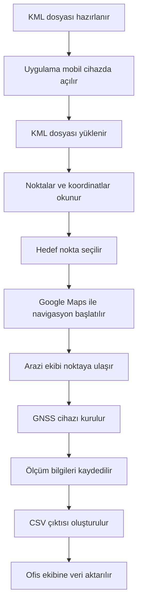

**KML Navigator**

KML Navigator, arazi ekiplerinin KML dosyaları üzerinden tanımlanan ölçü noktalarına mobil cihazla ulaşmasını, Google Maps ile navigasyon başlatmasını ve statik GNSS ölçüm bilgilerini CSV formatında kaydetmesini sağlayan web tabanlı bir saha yardımcı aracıdır.

Proje; yer kontrol noktası tesisi, fotogrametrik harita üretimi, karayolu yersel alımı ve arazi-ofis veri aktarımı süreçlerinde zaman kayıplarını azaltmak amacıyla geliştirilmiştir.

---

### Live Demo

```text
https://enesvta.github.io/KML-NAVIGATOR/
```

---

### Amaç

Arazi ekipleri, nokta tesis edilecek koordinatlara genellikle KML dosyaları üzerinden ulaşır. Bu süreçte noktaların manuel aranması, koordinatların farklı uygulamalara aktarılması ve statik GNSS ölçüm bilgilerinin elle not alınması zaman kaybına neden olabilir.

KML Navigator bu süreci tek bir mobil arayüzde toplar:

- KML dosyasındaki noktaları okur.
- Nokta kimlik bilgilerini ve koordinatları gösterir.
- Google Maps üzerinden hedef noktaya navigasyon başlatır.
- Statik GNSS ölçüm bilgilerini kaydeder.
- Kayıtları CSV olarak dışa aktarır.

---

### Temel Özellikler

- KML dosyası yükleme
- Nokta adı ve koordinat okuma
- Google Maps üzerinde nokta görüntüleme
- Kullanıcı GPS konumu takibi
- Hedef noktaya navigasyon başlatma
- Statik GNSS ölçüm kayıt formu
- Alet yüksekliği, başlangıç ve bitiş zamanı kaydı
- CSV dışa aktarım
- Mobil uyumlu arayüz
- GitHub Pages üzerinde çalışabilen hafif yapı
- PWA desteği için manifest ve service worker yapısı

---

### Kullanım Alanları

- Yer kontrol noktası tesisi
- Nirengi ve poligon noktası takibi
- Statik GNSS ölçümleri
- Fotogrametrik harita üretimi saha hazırlığı
- Karayolu yersel alım çalışmaları
- Arazi-ofis veri aktarımı
- KML tabanlı saha navigasyonu

---

### İş Akışı



---

### Kullanılan Teknolojiler

| Teknoloji | Kullanım Amacı |
|---|---|
| HTML | Arayüz yapısı |
| CSS | Mobil uyumlu tasarım |
| JavaScript | KML okuma, harita kontrolü, kayıt ve CSV işlemleri |
| Google Maps JavaScript API | Harita ve navigasyon bağlantıları |
| Geolocation API | Kullanıcı konumu alma |
| LocalStorage | Geçici veri saklama |
| CSV Export | Ölçüm kayıtlarını dışa aktarma |
| GitHub Pages | Web yayını |
| Web Manifest | PWA yapılandırması |
| Service Worker | PWA / önbellekleme desteği |

---

### CSV Çıktısı

Uygulama, saha ölçüm kayıtlarını CSV formatında dışa aktarır.

Örnek CSV alanları:

```text
Tarih, Nokta, Cihaz Adı, Alet Yüksekliği, Yük Tipi, Başlangıç Saati, Bitiş Saati, Koordinat
```

Örnek çıktı:

```csv
Tarih,Nokta,Cihaz Adı,Alet Yüksekliği,Yük Tipi,Başlangıç Saati,Bitiş Saati,Koordinat
2025-08-12,NK-101,GNSS-01,1.72m,Statik,09:15,10:45,"39.9207,32.8541"
2025-08-12,NK-102,GNSS-02,1.68m,Statik,11:10,12:40,"39.9182,32.8617"
```

---

### Proje Yapısı

```text
KML-NAVIGATOR/
│
├── icons/
│   └── logo.jpg
│
├── app.js
├── index.html
├── manifest.webmanifest
├── style.css
└── sw.js
```

---

### Dosyalar

| Dosya | Açıklama |
|---|---|
| `index.html` | Uygulamanın temel arayüzü |
| `style.css` | Mobil uyumlu görünüm |
| `app.js` | KML okuma, harita, navigasyon, kayıt ve CSV işlemleri |
| `manifest.webmanifest` | PWA yapılandırması |
| `sw.js` | Service worker yapısı |
| `icons/` | Uygulama ikonları |

---

### Kurulum

Projeyi yerel bilgisayarda çalıştırmak için:

```bash
git clone https://github.com/enesvta/KML-NAVIGATOR.git
cd KML-NAVIGATOR
```

Daha sonra `index.html` dosyasını tarayıcıda açabilirsiniz.

Google Maps servislerinin düzgün çalışması için internet bağlantısı ve geçerli Google Maps API yapılandırması gerekebilir.

---

### GitHub Pages ile Yayınlama

1. Repository sayfasında **Settings** bölümüne girin.
2. **Pages** sekmesini açın.
3. Source olarak `main` branch seçin.
4. Root klasörü seçin.
5. Kaydedin.
6. GitHub Pages bağlantısı üzerinden uygulamayı açın.

---

### Katkı

Bu proje, harita mühendisliği saha çalışmalarında karşılaşılan pratik problemleri yazılım destekli bir iş akışına dönüştürmeyi amaçlar.

Geliştirilen yapı:

- KML verisini sahada daha kullanılabilir hale getirir.
- Nokta bulma ve navigasyon sürecini hızlandırır.
- GNSS ölçüm notlarını standartlaştırır.
- CSV çıktısı ile ofis tarafındaki veri düzenleme yükünü azaltır.
- Arazi ve ofis ekipleri arasındaki bilgi aktarımını düzenli hale getirir.

---

### Sınırlamalar

- Google Maps servisleri için internet bağlantısı gerekir.
- Tarayıcı konum izni verilmezse kullanıcı konumu alınamaz.
- KML dosyasının doğru koordinat formatında olması gerekir.
- CSV dışa aktarımı cihaz ve tarayıcı izinlerine bağlı olarak farklı davranabilir.
- Uygulama saha yardım aracı olarak tasarlanmıştır; resmi ölçüm yazılımı yerine geçmez.

---

### Author

**Enes Şavata**  
Geomatics Engineering Student  
Hacettepe University

GitHub: [@enesvta](https://github.com/enesvta)

---

### License

Bu proje kişisel, akademik ve mesleki gelişim amacıyla hazırlanmıştır. Lisans bilgisi daha sonra eklenebilir.
